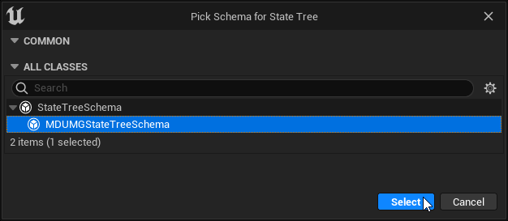

# MDUMGStateTree
An implementation of StateTree for controlling the state of UMG widgets.

This plugin will add your widget's sub-widgets and animations as context properties for you to build your state tree and provides a task to play widget animations.

## Requirements
This was built against 5.1 where State Tree is still pretty fresh, there appears to be changes in 5.2 that fixes bugs but I haven't tested compatibility.

## Getting Started
1. Clone this repo to your project or engine's Plugin folder.
2. Launch the editor and create a new State Tree asset:

3. Select `MDUMGStateTreeSchema` as your State Tree Schema:

4. Open the widget blueprint you're setting up your State Tree for.
5. At the top of the widget editor, select the **State Trees** dropdown and assign your newly created state tree.  
This is also where you'll assign any Parameters you expose on your state tree.

6. Open the editor for your State Tree asset.
7. In the top left, select your widget blueprint as the **Context Widget Class**
8. Add any additonal context properties you might need in your conditions/tasks/etc:

Now you're ready to build your state tree. When your widget is constructed, the state tree will automatically begin and tick along with your widget.
Check [Epic's documentation](https://docs.unrealengine.com/5.1/en-US/state-tree-in-unreal-engine/) on State Trees for more information on building one.
